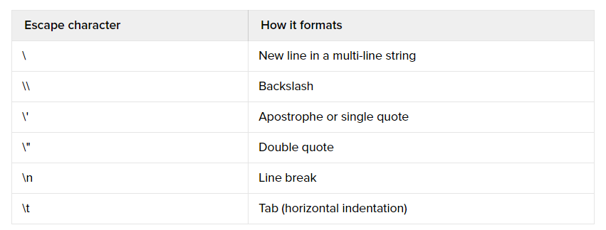

## Cách định dạng text trong python 3

- Tham khảo: https://www.digitalocean.com/community/tutorials/how-to-format-text-in-python-3

## Giới thiệu

- Chuỗi được được tạo ra bởi các chữ cái và ký tự. 
- Python có khả năng định dạng và thao tác với các chuỗi.

## String Literals

- Có hai khái niệm cần phân biệt: `string literal` và `string value`.
- `String literal`: Là chuỗi mà chúng ta nhìn thấy trong mã nguồn của python
- `String value`: Là chuỗi được hiển thị ra trong lệnh `print`
- Ví dụ: Gõ dòng sau trong IDLE hoặc python CLI
	```sh
	print ("Hoc Chu Dong \n 2017")
	```

- Kết quả là, ta sẽ nhìn thấy ký tự `\n` trong đoạn code nhưng ko thấy trong lúc hiển thị, thay vào đó là xuống dòng.
	```sh
	Hoc Chu Dong
	 2017
	```

## Dấu nháy kép và dấu nháy đơn

- Chuỗi có thể bao bọc trong dấu nháy đơn hoặc dấu nháy kép.
- Nếu trong chuỗi có chứa các dấu nháy đơn thì bao đóng chuỗi là dấu nháy kép và ngược lại
	```sh
	my_str = 'Hoc Chu Dong"s'
	print my_str
	```

- Hoặc
	```sh
	my_str = 'Hoc Chu Dong"s'
	print my_str
	```

## Chuỗi trên nhiều dòng

- Để in chuỗi trên nhiều dòng ta sử dụng cặp ba dấu nháy đơn `'''` hoặc ba dấu nháy kép `"""`, ví dụ:
	```sh
	print '''Hoc Chu Dong
	2017
	'''
	```

- hoặc 
	```sh
	print """Hoc Chu Dong
	2017"""
	```

- Kết quả của các đoạn lệnh trên là
	```sh
	Hoc Chu Dong
	2017
	```

## Ký tự ngắt trong chuỗi

- Trong chuỗi có các ký tự ngắt chuỗi cần chú ý, các ký tự này được được bắt đầu bởi ký tự `\`
- Quan sát bảng dưới để biết được chức năng của các ký tự ngắt chuỗi trong python


- Gõ các dòng dưới vào CLI của python

```sh
print 'Hoc chu \t dong'

print 'Hoc chu \n dong'
```

## Chuỗi dữ liệu thô `Raw string`

- Chuỗi dữ liệu thô là chuỗi nhập vào như nào thì in ra như thế
- Sử dụng ký tự `r` trước chuỗi để thực hiện xử lý chuỗi dữ liệu thô, ví dụ
	```sh
	print r"Hoc chu &**^$#^*(\"\")) dong"
	```

- Kết quả là
	```sh
	Hoc chu &**^$#^*(\"\")) dong
	```
